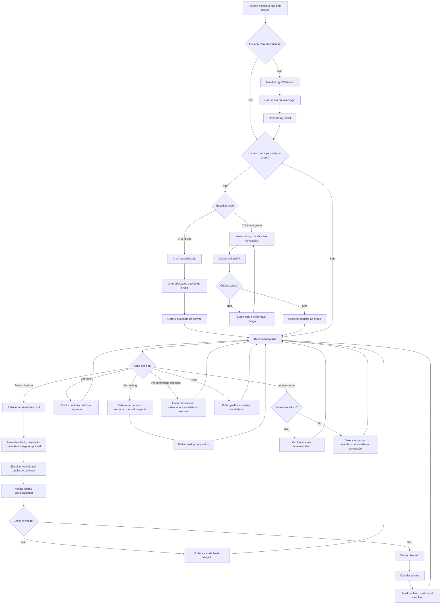
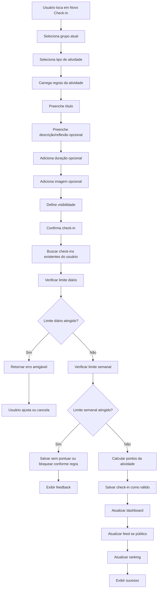
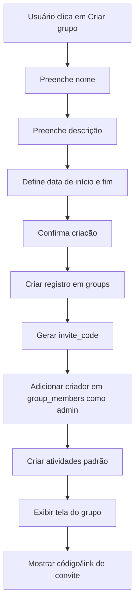
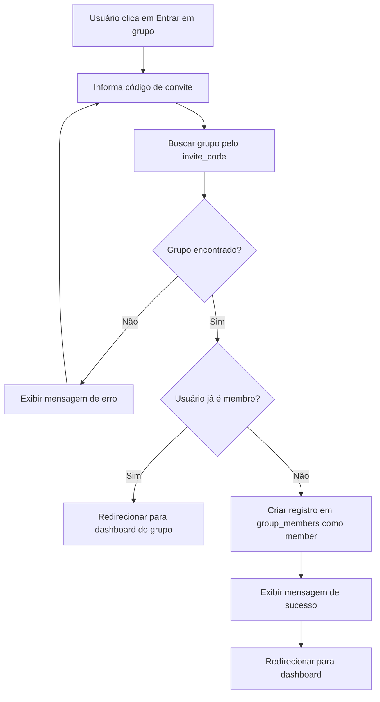
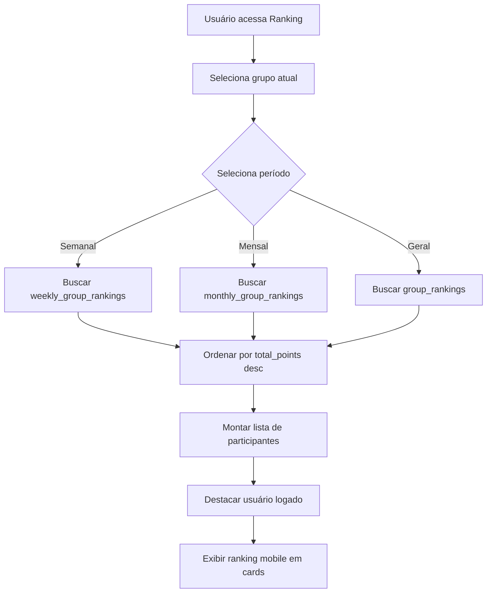
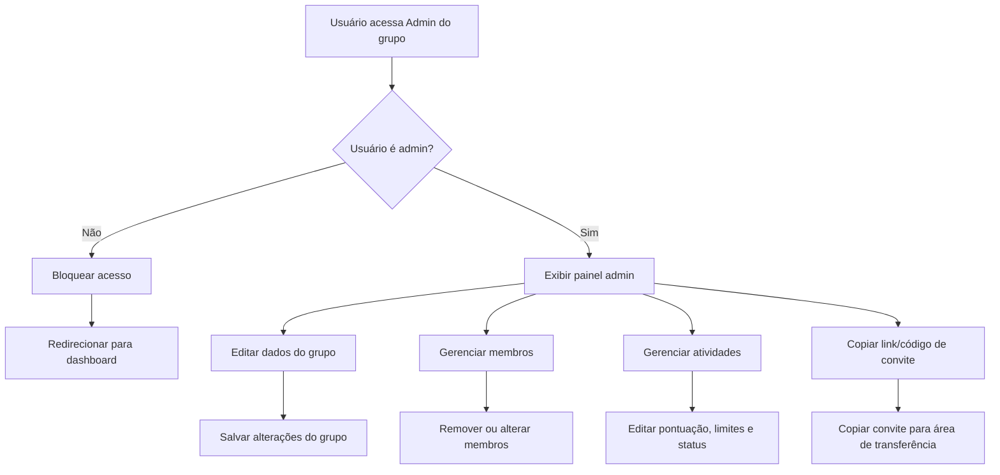
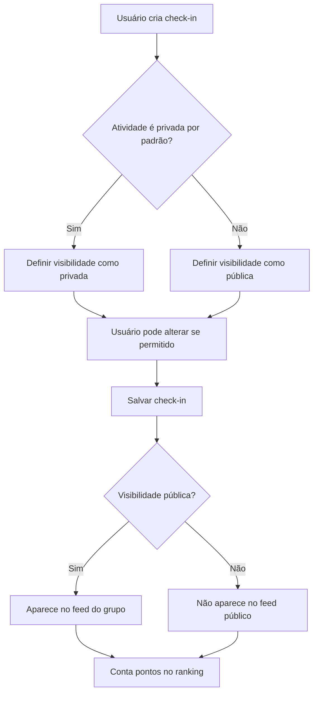

# Flowcharts — Santos Hábitos

Este arquivo contém os fluxos principais do app em Mermaid.

---

## 1. Fluxo principal do aplicativo

---

## 2. Fluxo de criação de check-in

---

## 3. Fluxo de criação de grupo

---

## 4. Fluxo de entrada em grupo por convite

---

## 5. Fluxo de ranking

---

## 6. Fluxo de admin do grupo

---

## 7. Fluxo de privacidade do check-in

